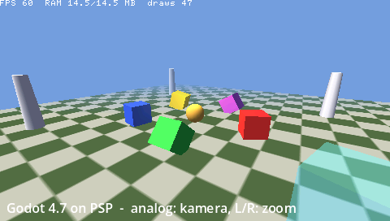

# Godot 4.7 for the Sony PSP

An experimental port of **Godot Engine 4.7.2** to the **Sony PlayStation Portable** (tested on a PSP-2001 “Slim”).
Scenes made in the regular Godot 4.7 editor run on real PSP hardware. That includes 3D, 2D/UI, text and **GDScript**.



*The demo scene (`misc/psp/demo3d`): a textured ground, lit spinning boxes, a GDScript-animated sphere, a transparent
cube, fog, a HUD label and an FPS/RAM overlay. It runs at 60 FPS (vsync) on PSP-2001 hardware.*

---

## Contents

- [Status](#status)
- [How it works](#how-it-works)
- [Fitting Godot 4 into a PSP](#fitting-godot-4-into-a-psp)
- [Building](#building)
- [Making a game](#making-a-game)
- [Running on a PSP](#running-on-a-psp)
- [Testing](#testing)
- [Supported features](#supported-features)
- [Limitations](#limitations)
- [Repository layout](#repository-layout)
- [License](#license)

---

## Status

| | |
|---|---|
| Target | PSP-2000/3000 series (64 MB RAM, `MEMSIZE=1`). A custom firmware is required to run unsigned homebrew |
| Engine | Godot 4.7.2-stable, `template_release`, single-threaded (`threads=no`) |
| Graphics | New fixed-function backend (`drivers/psp_gu`) on top of the PSP GE via `sceGu` |
| Scripting | GDScript (full compiler + VM) |
| Demo | 60 FPS. EBOOT ≈ 20.3 MB, heap peak ≈ 14.5 MB, ≈ 16 MB of the ~52 MB user RAM left free |
| Verified | PPSSPP 1.20.4 (headless, automated) and a real PSP-2001 |

This is a hobby / research project. It is **not** an official Godot platform and is not affiliated with the Godot
Foundation or Sony.

## How it works

Godot 4's renderers (Forward+, Mobile, Compatibility) all depend on programmable shaders: Godot generates
shader code for every material. The PSP's GPU, the **GE (Graphics Engine)**, is a **fixed-function** GPU. It does
hardware transform and lighting, blending, fog and texture combiners, but it cannot run shader programs.

Instead of emulating a shader API, the port adds a new backend at Godot's `RendererCompositor` level. This is
the same layer where the GLES3 driver lives. Everything above that layer is stock Godot: the scene tree, the
`RenderingServer`, culling, light/object pairing, resource loading and GDScript.

```
Scene tree (Node3D, MeshInstance3D, Label, …)       unchanged
        │
RenderingServer                                    unchanged
        │
RendererSceneCull / RendererCanvasCull             unchanged (culling, light pairing, sorting)
        │
RendererCompositor ── Forward+/Mobile → RenderingDevice → Vulkan/D3D12/Metal
                   ├─ Compatibility   → OpenGL ES 3
                   └─ PSP GU (new)    → sceGu → GE hardware
```

How each Godot concept maps onto the GE:

| Godot | PSP backend |
|---|---|
| Materials (`StandardMaterial3D`) | Shaders are **never compiled**. The generated shader source is scanned for flags (`unshaded`, cull mode, blend, alpha scissor, vertex color, texture filter), which are mapped to GE render states. Whitelisted parameters (albedo, albedo texture, UV1 scale/offset) are stored |
| Lighting | GE hardware lights: per-vertex (Gouraud), diffuse only. Directional, omni and spot lights; the 4 most relevant lights per object are chosen |
| Meshes | Converted once at load time into a compact GE vertex format. Godot's arrays are dropped |
| Textures | Converted to 16-bit swizzled GE textures and cached in VRAM (LRU) |
| Camera | Godot's projection and view matrices are loaded straight into the GE matrix registers (both use GL-style clip space) |
| Environment | Background color, ambient light, GE fog (exponential fog is approximated linearly) |
| Transparency | GE blending and alpha test, with back-to-front sorting |
| 2D canvas | GE *through mode*: vertices are transformed to screen space on the CPU and written into the display list. 2D meshes go through the 3D path with a pixel-space orthographic projection |
| Text | FreeType text server; glyph atlases use the same 16-bit texture path |

The platform layer (`platform/psp`) provides:
- boot through `--path` or `--main-pack game.pck`,
- a `DisplayServer` with vsync and controller input,
- a clean exit from the HOME menu, with a 3-second watchdog,
- a logger that also writes to PPSSPP's debug channel.

## Fitting Godot 4 into a PSP

The PSP-2001 has a 333 MHz MIPS32 CPU (single-precision FPU only), 64 MB of RAM (≈ 52 MB available to games) and
2 MB of VRAM. The measures below keep the port within that budget.

**Code size (≈ 20 MB EBOOT)**
- `template_release`, `optimize=size`, exceptions off, single-threaded build.
- All modules are off by default. Only GDScript, FreeType + `text_server_fb` and Brotli (for the embedded WOFF2 font) are enabled.
- Physics, navigation, XR, audio, networking and the advanced GUI classes are compiled out. The advanced GUI alone saved 2 MB.
- The Vulkan/RD renderer is not compiled.
- The linker drops unused sections (`--gc-sections`). A custom linker script `KEEP`s the PSP import/NID tables, which would otherwise be discarded and leave the EBOOT unable to boot.

**Mesh data**
- Unlit and 2D surfaces store positions as 16-bit integers normalized to the surface AABB; the scale is folded into the model matrix.
- Lit surfaces keep float positions, so lighting never depends on normal renormalization.
- Normals are 8-bit and UVs 16-bit, with range and offset restored via `sceGuTexScale`/`sceGuTexOffset`. Indices are 16-bit.
- A typical vertex is 14–20 bytes instead of ~32. Draws larger than 65 535 elements are split.

**Textures**
- Converted to 16-bit. The format depends on the alpha channel: 5650 when opaque, 5551 for 1-bit alpha, 4444 for soft alpha.
- Resized to the nearest power of two, at most 256×256, and swizzled for faster GE sampling.
- For large mipmapped images, only the smallest mip level that covers the target size is decoded.
- The source `Image` is not kept.
- About 1.2 MB of VRAM (what is left after the framebuffers) serves as an **LRU texture cache**. Eviction is frame-safe: a texture the GE may still read in the current frame is never evicted.

**Framebuffers and memory accounting**
- Two 16-bit (565) color buffers and a 16-bit depth buffer, ≈ 816 KB of VRAM in total.
- Two 64 KB display lists. They are written through the **uncached** memory mirror, so the GE never reads stale CPU cache lines. On real hardware this was the cause of flickering, which PPSSPP does not emulate.
- The heap is measured with `mallinfo`. Heap trimming is disabled, so the reported peak is a true high-water mark.
- Out-of-memory conditions are logged as `[PSP] FAIL OOM`.

**Toolchain gotchas that had to be solved**
- In pspdev's newlib, `int32_t` is `long`, while Godot assumes it is `int`. This single difference caused 27 000+ compile errors. It is solved by one forced-include header (`platform/psp/psp_stdint_fix.h`) that remaps the compiler's fixed-width type macros.
- An explicit `-lc` resolved `chdir`/`getcwd` from newlib instead of `libcglue`, so the game directory could not be found.
- GCC predefines a `mips` macro on this target, which clashes with identifiers named `mips`. It is undefined with `-Umips`.

## Building

Requirements:
- the [pspdev](https://github.com/pspdev/pspdev) toolchain (release tarball) in `~/pspdev`, or `PSPDEV` set,
- SCons and Python 3,
- optionally the Godot 4.7 editor, to export games (`GODOT_EDITOR=/path/to/godot`).

```bash
source tools/psp/env.sh
scons platform=psp -j$(nproc)
# → bin/godot.psp.template_release.mips32.nothreads.elf
```

The defaults live in `platform/psp/detect.py`. For example, `module_gdscript_enabled=no` saves about 0.9 MB of code.

## Making a game

1. Create a normal Godot 4.7 project. The *Compatibility* renderer is a good choice for editor previews; the PSP ignores the project renderer.
2. Set texture imports to **Compress Mode: VRAM Uncompressed** with mipmaps off. The PSP build has no PNG or WebP decoders for imported textures.
3. Add an export preset named **`PSP`** for any desktop platform. Only a `.pck` file is produced.
4. Export and package:
   ```bash
   tools/psp/export_pck.sh path/to/project game.pck
   tools/psp/stage_game.sh game.pck out/GodotGame      # → EBOOT.PBP + game.pck
   ```
5. Optional project setting: `psp/show_stats = true` draws FPS, RAM and draw calls in the top-left corner.

Script-free behaviors are also available through node metadata:

| Metadata | Effect |
|---|---|
| `psp_behavior = "spinner"`, `spin_speed = Vector3(deg/s)` | Rotates a `Node3D` |
| `psp_behavior = "orbit_camera"`, `orbit_target = Vector3` | `Camera3D` orbit: analog/d-pad rotates, L/R zooms, idles slowly |

The included demo is `misc/psp/demo3d`.

## Running on a PSP

1. Install a custom firmware (for example 6.61 PRO-C or LME on a PSP-2000/3000).
2. Copy the game folder to the Memory Stick:
   ```
   ms0:/PSP/GAME/GodotDemo/EBOOT.PBP
   ms0:/PSP/GAME/GodotDemo/game.pck
   ```
3. Launch it from XMB → Game → Memory Stick. HOME → Exit quits cleanly.

The PSP controller maps to Godot joypad 0:

| PSP | Godot |
|---|---|
| Cross | A |
| Circle | B |
| Square | X |
| Triangle | Y |
| L / R | Left / Right shoulder |
| Select / Start | Back / Start |
| D-pad | D-pad |
| Analog stick | Left stick |

## Testing

```bash
tools/psp/build_ppsspp_headless.sh     # once: builds PPSSPPHeadless (+ SDL2) without root
tools/psp/run_psp_tests.sh
```

Each test boots an EBOOT in headless PPSSPP. It checks `[PSP] …` log lines and pixels of a captured frame; the
captures are saved as `bin/psp_tests/<test>/screenshot.png`. The suite covers:
- boot, clean exit through the real exit callback, the watchdog, vsync timing and peak memory,
- an in-EBOOT selftest: input mapping, paths, texture formats and swizzle, the VRAM cache, light pairing, normal encoding and OOM handling,
- 3D: meshes, lighting, culling (verified to fail when the winding is inverted), fog, blending, textures, more than 4 lights, huge meshes, 900-draw list overflow, vertex colors and position-only meshes,
- 2D: rects, sprites, polygons, Camera2D, clipping, 2D meshes with modulate, a 3 000-point `Line2D`, and labels with real glyphs,
- GDScript, both from a project folder and from an exported `.pck`,
- the full demo at 30 FPS or more with peak RAM under 44 MB.

Test hooks are files placed next to the EBOOT:
- `psp_screenshot_at_frame`: capture the given frame,
- `psp_quit_after_frames`: request an exit after N frames, through the same path as HOME → Exit,
- `psp_selftest`: run the in-EBOOT unit tests.

## Supported features

- **3D:**
  - `MeshInstance3D` (primitive meshes and `ArrayMesh`),
  - `Camera3D` (perspective; orthogonal should work but is untested),
  - `DirectionalLight3D`, `OmniLight3D`, `SpotLight3D`,
  - `WorldEnvironment` (background color, ambient, fog).
- **Materials:** `StandardMaterial3D` (`ORMMaterial3D` uses the same code path but is untested):
  - albedo color and texture, UV1 scale and offset,
  - shaded or unshaded,
  - cull back, front or disabled,
  - transparency (alpha, alpha scissor, additive),
  - vertex color as albedo,
  - nearest or linear filtering.
- **2D:**
  - `ColorRect`, `Sprite2D`, `NinePatchRect`/`Panel` (stretch),
  - `Polygon2D`, `Line2D`, `MeshInstance2D`, draw primitives,
  - `Camera2D`, `CanvasLayer`, `Control` clipping,
  - `Label` text with the default embedded font or project fonts. Other controls such as `Button` use the same text path but are untested.
- **Scripting:** GDScript. Node metadata behaviors are available as a script-free alternative.
- **Input:** PSP buttons and analog stick as joypad 0 (see the table above).
- **Resources:** exported `.pck` files. Scenes are binary `.scn` and scripts are tokenized, both as produced by the export.

## Limitations

**Rendering (hardware and design limits)**
- **No custom shaders.** `ShaderMaterial` and visual shaders are drawn with a white albedo and a one-time warning. Only the features that `BaseMaterial3D` exposes and the GE can express are supported.
- **Per-vertex lighting only.** No PBR (metallic, roughness, specular), normal maps, emission textures or rim/clearcoat. At most 4 hardware lights per object.
- **No real-time shadows yet.** Baked lighting through vertex colors or textures works. Blob and planar shadows are possible on the GE and planned.
- **No post-processing:** glow, SSAO, SSR, SDFGI, VoxelGI, LightmapGI, sky, tonemapping, color correction and depth of field.
- **No** decals, reflection probes, particles (CPU or GPU), `MultiMesh`, or skeletal/blend-shape animation. `AnimationPlayer` is compiled in and animating node transforms should work, but it is untested.
- **Fog** is linear, per-vertex GE fog; exponential fog is approximated. Colors are used as-is (no linear-space lighting).
- **Near-plane clipping:** the GE does not clip triangles against the near plane. Very large triangles close to the camera can drop out, so subdivide large ground meshes.
- **Textures** are limited to 256×256 and 16 bits per pixel. Use the **VRAM Uncompressed** import mode. VRAM-compressed imports (S3TC/ETC/ASTC/Basis) are not supported, because the decompressors are compiled out; such textures are drawn untextured, with a warning. *Lossless* (PNG) imports may load through the built-in PNG loader, but are untested; WebP and JPEG are not included. `surface_get_arrays()` and `Texture2D.get_image()` return empty data at runtime, because the source data is freed.
- **2D:** no canvas shaders, canvas lights or shadows, `CanvasItemMaterial` blend modes, `CanvasTexture`, 2D particles or multimesh, or Skeleton2D deformation. NinePatch tile modes are ignored, and nine-patches smaller than their margins skip cells instead of shrinking them. Each glyph and rect is a separate draw, so very text-heavy UIs may hit display-list flushes.
- **One screen:** `SubViewport`s and multiple render targets are not supported. Everything renders straight to the framebuffer at 480×272.

**Engine and platform**
- **Compiled out:** physics (2D/3D), navigation, audio, networking/HTTP, XR, the advanced GUI (`Tree`, `TextEdit`, `GraphEdit`, …), threads and GDExtension. Re-enabling physics or audio would need new platform drivers and more RAM.
- **No sound yet:** no audio driver for the PSP has been written.
- **Single-threaded:** `threads=no`; `Thread`, `WorkerThreadPool` and threaded resource loading run synchronously.
- **Performance:** the CPU runs at 333 MHz with a single-precision FPU, while Godot uses `double` for many internal values. Keep `_process` light and scenes small (tens of draw calls, a few thousand vertices).
- **Memory:** about 36 MB is used by the demo, leaving ≈ 16 MB for game content. There is no virtual memory; running out is fatal and is logged as `[PSP] FAIL OOM`.
- **Save data:** the location of `user://` on the PSP is untested. The PSP save-data utility and system dialogs are not integrated.
- **Editor integration:** there is no PSP export preset in the editor. Export a `.pck` with the provided scripts.

**Verification**
- Automated tests run in PPSSPP. Real hardware was verified manually with the demo on a PSP-2001; other models and firmwares are untested.
- Some internal notes and code comments are in Turkish (`docs/psp/porting-notes.md`, `docs/psp/spike-report.md`, `docs/superpowers/`).

## Repository layout

```
platform/psp/          PSP platform: entry point, OS, DisplayServer/input, exit handling, logger, behaviors, selftest
drivers/psp_gu/        GE renderer: compositor, 3D scene, 2D canvas, GE context/VRAM cache, texture conversion, storages
misc/psp/demo3d/       Demo project (open it with the Godot 4.7 editor)
tools/psp/             Build/packaging/export scripts, headless PPSSPP build, test runner and image checks
tests/psp/             Test EBOOT (hello), test projects used by run_psp_tests.sh
docs/psp/              This README, porting notes (every engine change), spike report, screenshot
```

Changes outside these folders are small and guarded by `PSP_ENABLED` / `RENDERER_RD_DISABLED`. They are listed one
by one in `docs/psp/porting-notes.md`.

## License

Godot Engine and this port are released under the **MIT license** (see `LICENSE.txt` and `COPYRIGHT.txt`).
Third-party components keep their own licenses. The pspdev toolchain and PPSSPP are not included in this
repository. “PlayStation” and “PSP” are trademarks of Sony Interactive Entertainment; this project is not
affiliated with or endorsed by Sony.
